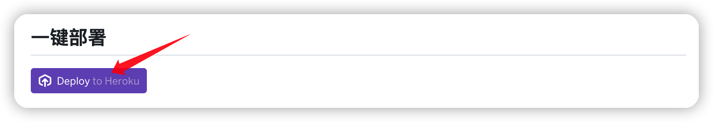
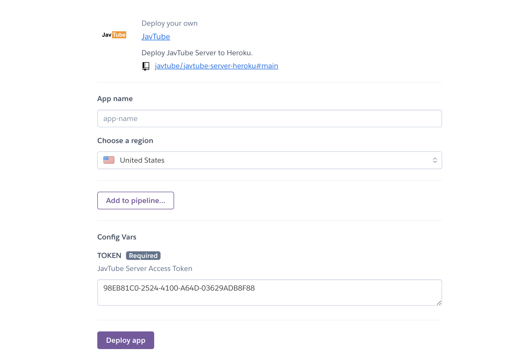
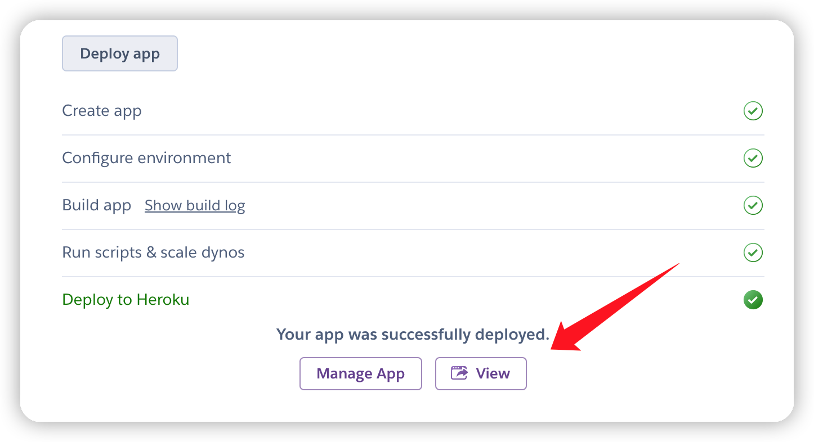
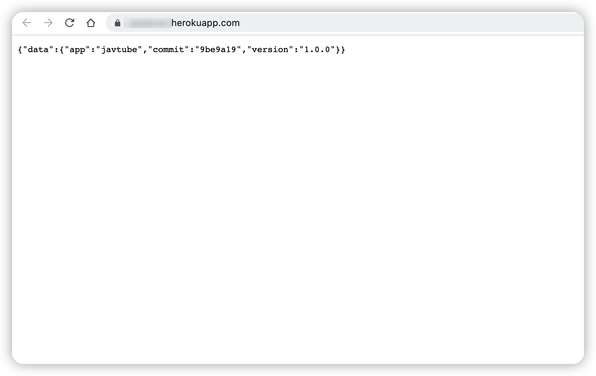
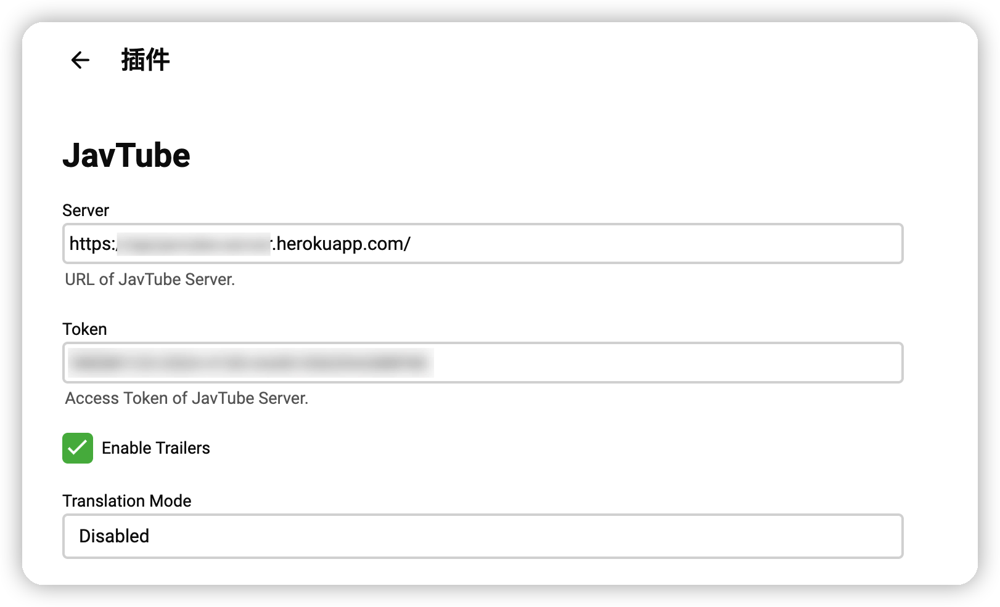
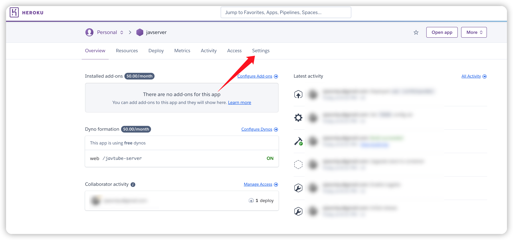
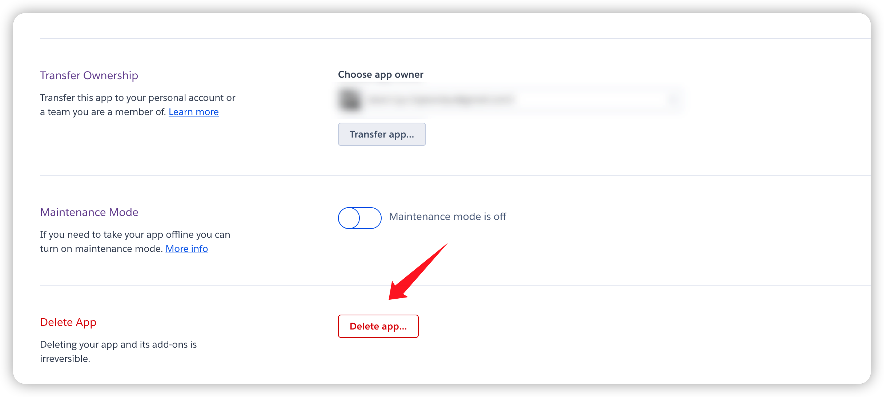
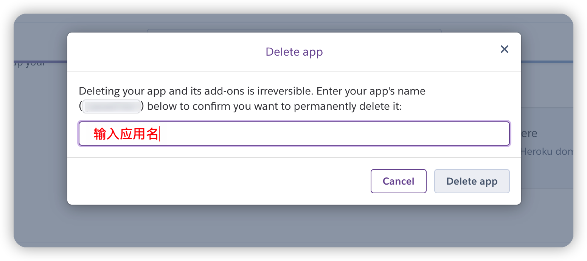

# JavTube Server Heroku

使用本项目可以快速将`JavTube`后端**免费**部署至[`Heroku`](https://heroku.com)云平台。

## 一键部署

## 具体说明

> 以下步骤需要登录Heroku账号，没有账号的可以先进行[注册](https://signup.heroku.com/)。

- [部署应用](#部署应用)
- [删除应用](#删除应用)
- [更新应用](#更新应用)

### 部署应用

- 点击本页面中的[一键部署](#一键部署)按钮创建app。

- 在`App name`中输入自定义的应用名。
- **建议**将地区选择为`United States`。
- 在`Config Vars`中重新输入新的`TOKEN`并**复制**。
- 点击`Deploy app`完成部署。

- 右键**复制**View中的链接地址作为`JavTube Server URL`。

- 点击View，出现类似如下的页面即为成功部署。

- 在JavTube插件中分别粘贴进之前复制的`JavTube Server URL`与`TOKEN`，即可完成插件配置。

### 删除应用

- 进入[Heroku Dashboard](https://dashboard.heroku.com/apps)，点击需要删除的应用。

- 点击设置`Settings`。

- 拉到设置最底部，点击`Delete app`。

- 按提示，重新输入一遍应用名以删除应用。

### 更新应用

> 更新应用有许多方式，这里仅例举一种最简单的方式。

- 删除并重新创建应用即可，注意`app name`和`token`需保持一致。
