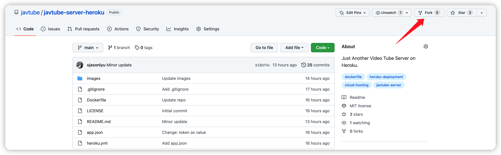
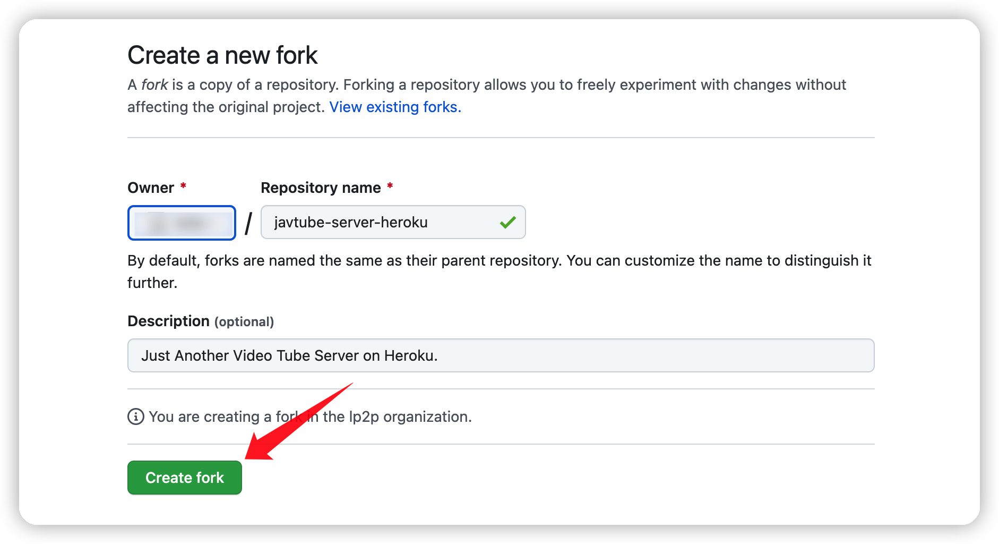
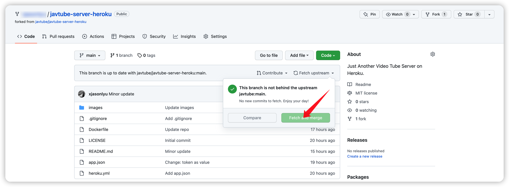
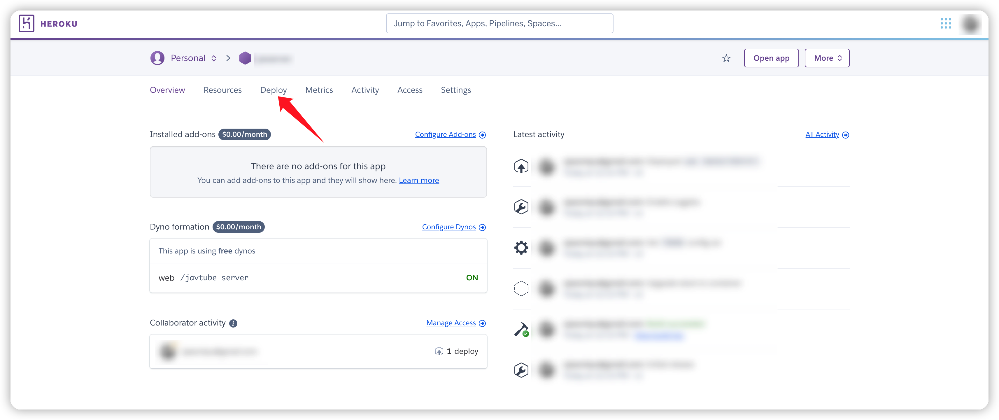
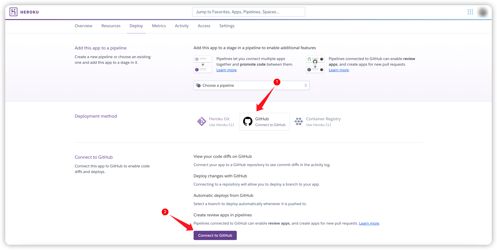
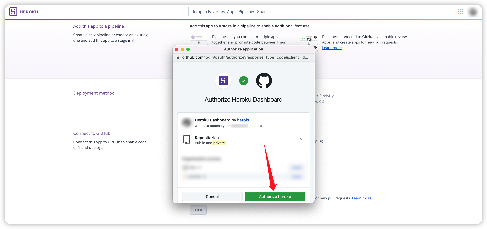
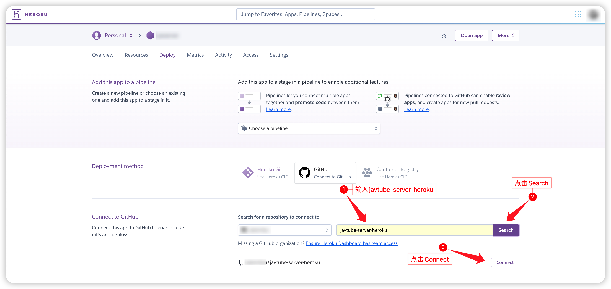
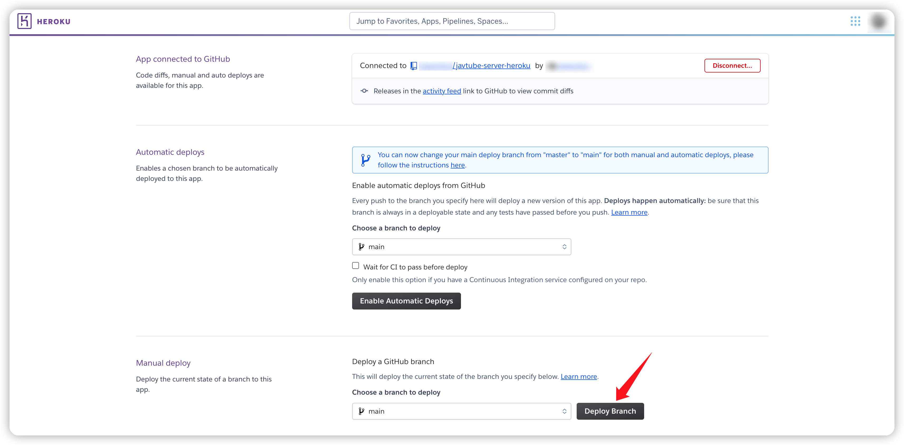
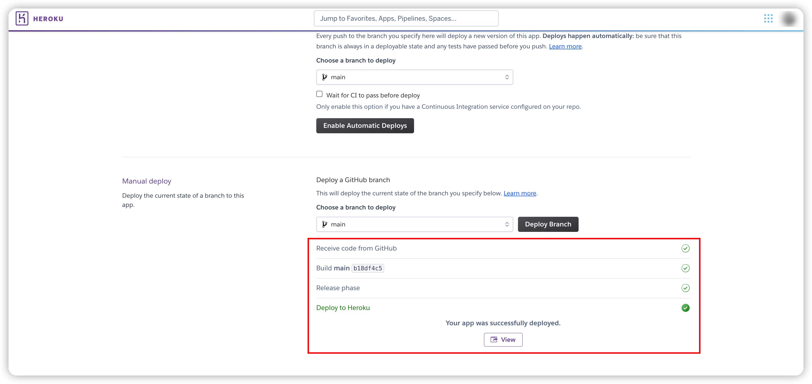
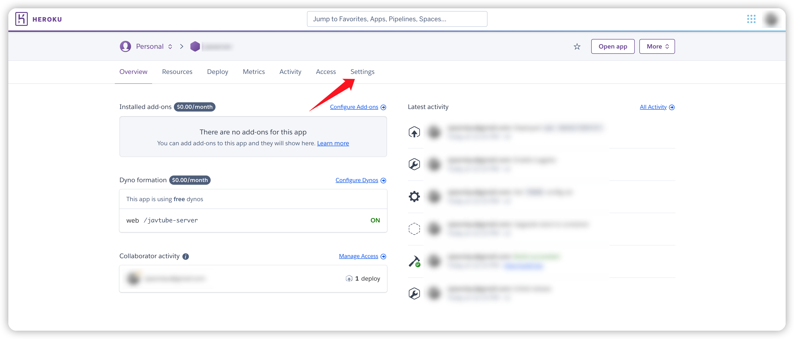

# JavTube Server Heroku

<!-- 
 -->

> - 部分新建的应用有可能需要科学访问，如果需要可以套一层Cloudflare CDN或Workers。
> - Heroku对免费账号存在如内存、冷启动等限制，但是对于个人部署使用JavTube后端项目理论上是足够的，具体可以参考[Pricing](https://www.heroku.com/pricing)。

使用本仓库可以快速将`JavTube`后端**免费**部署至[`Heroku`](https://heroku.com)云平台。

## 一键部署

## 具体说明

> 以下步骤需要登录Heroku账号，没有账号的可以先进行[注册](https://signup.heroku.com/)。

- [部署应用](#部署应用)
- [更新应用](#更新应用)
- [删除应用](#删除应用)

### 部署应用

- 点击本页面中的[一键部署](#一键部署)按钮创建app。

- 在`App name`中输入自定义的应用名。
- **建议**将地区选择为`United States`。
- 在`Config Vars`中输入新的`TOKEN`并**复制**。
- 点击`Deploy app`完成部署。

- 右键**复制**View中的`JavTube Server URL`链接地址。

- 可以点击View，出现类似如下的页面即为部署成功。

- 在JavTube插件中分别粘贴进之前复制的`JavTube Server URL`与`TOKEN`以完成插件配置。

### 更新应用

- 点击本仓库右上方的`Fork`按钮。

- 点击`Create fork`。

- 如果**之前已经Fork过**本仓库，则选择`Fetch upstream -> Fetch and merge`，**否则跳过此步骤**。

> 建议每次在更新后端之前，都尝试`Fetch and merge`以与源仓库保持同步。

- 然后进入[Heroku Dashboard](https://dashboard.heroku.com/apps)，选择之前部署的应用。

- 在Dashboard中，选择`Deploy`。

- 在`Deploy`中，选择`GitHub`并点击`Connect to GitHub`。

- 在弹出的页面中，点击`Authorize Heroku`。

- 按如下步骤连接之前Fork的仓库。

- 点击`Deploy Branch`，即可完成更新。

> 后续更新后端也只需要点击`Deploy Branch`即可。

- 如下图所示，即表示已完成更新。

> PS：当然也可以直接通过**删除**并**重新创建**应用来进行更新，但是注意`app name`和`token`需要和之前保持一致。

### 删除应用

- 进入[Heroku Dashboard](https://dashboard.heroku.com/apps)，点击需要删除的应用。

- 点击设置`Settings`。

- 拉到设置最底部，点击`Delete app`。

- 按提示，重新输入一遍应用名以删除应用。

